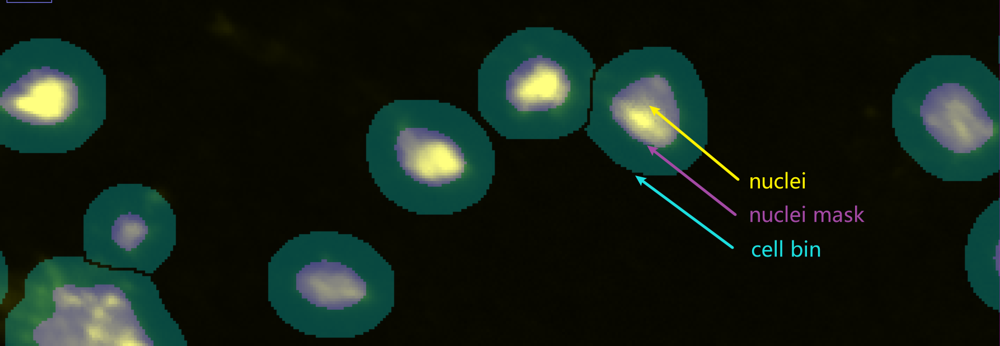

<div align="center">
  <br/>
  <h4 align="center">
    A framework for generating single-cell gene expression data
  </h4>
</div>


[Release Notes](CHANGES.txt)

# Installation
Both on Windows or Linux (CentOS, Ubuntu), just
```shell
pip install -r requirements.txt
```

Pyvips linux installation
```shell
# linux environ install pyvips using conda
conda install --channel conda-forge pyvips
```

Pyvips windows install vips from [vips](https://github.com/libvips/libvips/releases)
```shell
pip install --user pyvips==2.2.1
```

```python
# add vips path when running python script
import os
vipsbin = r'c:\vips-dev-8.13\bin'
os.environ['PATH'] = vipsbin + ';' + os.environ['PATH']
```

# Develop mode
```shell
git clone https://gitlab.genomics.cn/biointelligence/implab/stero-rnd/cellbin/algorithms/cellbin.git
conda activate env # activate your env
python setup.py develop --no-deps  # develop mode, if you already have deps installed
```

# Usage
* API doc
* [How to get weights?](docs/weights.md)


## <div align="center">contribute</div>
We love your input! We want to make contributing to cellbin as easy and transparent as possible. Please see,
- When you need to change other people's modules, remember to note the change information in the change location. like,
``` a = 0  #  parameter value to zero [by jack]```

Thank you to all our contributors!


## <div align="center">Contact</div>

For cellbin bugs and feature requests please visit 
